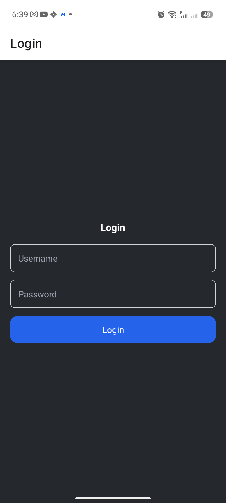
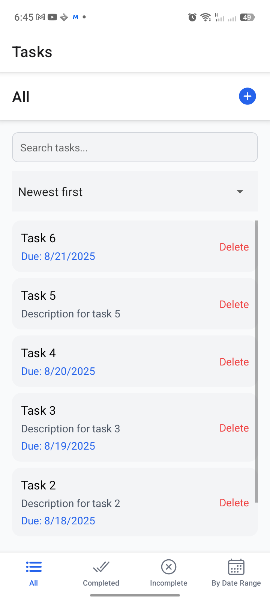

# TaskMate

[](LICENSE)  
[](https://reactnative.dev/)  
[](https://axios-http.com/)

**TaskMate** is a mobile app that allows users to create, update, and delete tasks seamlessly. It helps you stay organised by managing your tasks across devices using a backend task manager API.

---

## Features

- Add tasks with a title, description, and due date
- Delete tasks
- Mark tasks as complete or incomplete
- Store tasks on a database using [Task Manager API](https://github.com/Tshergzeh/task-manager) to sync across devices

## Screenshots

  
*Login*

  
*Task list view*

  
*Adding a new task*

## Technologies Used

- React Native
- Axios

## Getting Started

1. Clone the repository
2. Install [Node.js](https://nodejs.org/en/download/current)
3. Install the Expo CLI:
```bash
npm install -g expo-cli
```
4. Install dependencies:
```bash
npx expo install
```
5. Start the application:
```bash
npx expo start
```

## Usage

- Open the app on your mobile device or emulator.
- Add a new task by filling in the title, description, and due date.
- Mark tasks as complete/incomplete or delete them as needed.
- Your tasks are stored in the backend and synced across devices.

## Contributing

Contributions are welcome! To contribute:

1. Fork the repository
2. Create a new branch (git checkout -b feature-name)
3. Make your changes and commit (git commit -m 'Add some feature')
4. Push to the branch (git push origin feature-name)
5. Open a pull request

## License

This project is licensed under the MIT License. See the LICENSE file for details.
